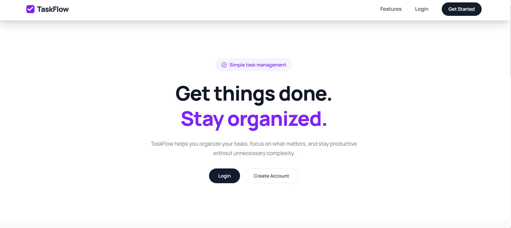
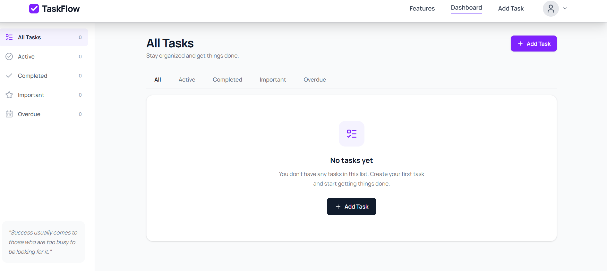
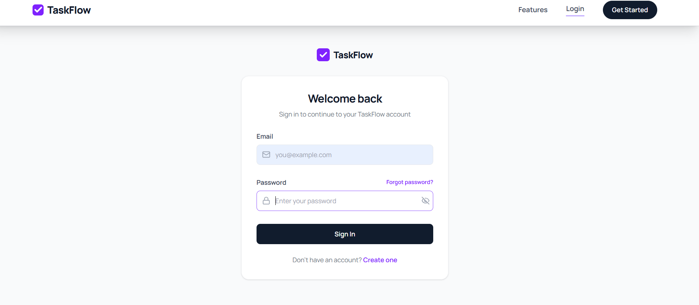
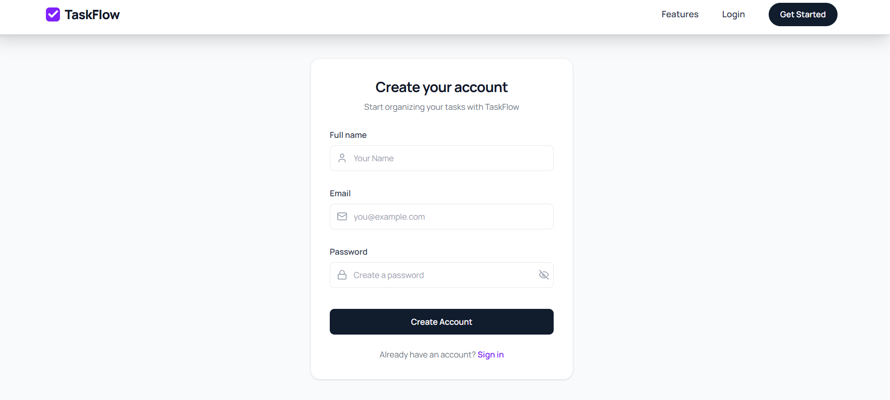

# TaskFlow

A full-stack task management application built with React, Node.js, Express, and MongoDB.

## 🔗 Live Demo

[View TaskFlow Live](https://fullstack-projects-eta.vercel.app)

## 📸 Screenshots

### Home


### Dashboard


### Add / Edit Task


### Login


### Register


## ✨ Features

- User registration and login
- JWT-based authentication with HTTP-only cookies
- Create, update, and delete tasks
- Mark tasks as completed
- Mark tasks as important
- Set task priority and due dates
- Filter and manage tasks
- Email verification using OTP
- Password reset using OTP
- Protected routes
- User-specific task management
- Responsive design for desktop and mobile

## 🛠️ Tech Stack

### Frontend

- React
- React Router
- Context API
- Tailwind CSS
- JavaScript (ES6+)
- Fetch API

### Backend

- Node.js
- Express.js
- MongoDB
- Mongoose
- JWT
- bcrypt
- Nodemailer

## 📁 Project Structure

```text
taskflow/
├── frontend/
├── backend/
├── screenshots/
└── README.md